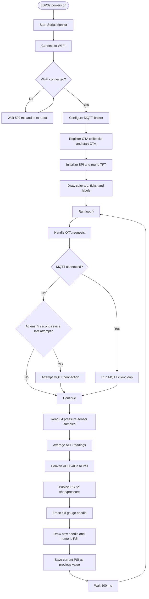

# Digital Pressure Gauge Flowchart

This chart reflects the main control flow in `gauge_finishdesign1_OTA.ino`.

```mermaid
flowchart TD
    A(["ESP32 powers on"]) --> B["Start Serial Monitor"]
    B --> C["Connect to Wi-Fi"]
    C --> D{"Wi-Fi connected?"}
    D -- "No" --> E["Wait 500 ms and print a dot"]
    E --> D
    D -- "Yes" --> F["Configure MQTT broker"]
    F --> G["Register OTA callbacks and start OTA"]
    G --> H["Initialize SPI and round TFT"]
    H --> I["Draw color arc, ticks, and labels"]
    I --> J["Run loop()"]
    J --> K["Handle OTA requests"]
    K --> L{"MQTT connected?"}
    L -- "No" --> M{"At least 5 seconds since last attempt?"}
    M -- "Yes" --> N["Attempt MQTT connection"]
    M -- "No" --> O["Continue"]
    N --> O
    L -- "Yes" --> P["Run MQTT client loop"]
    P --> O
    O --> Q["Read 64 pressure-sensor samples"]
    Q --> R["Average ADC readings"]
    R --> S["Convert ADC value to PSI"]
    S --> T["Publish PSI to shop/pressure"]
    T --> U["Erase old gauge needle"]
    U --> V["Draw new needle and numeric PSI"]
    V --> W["Save current PSI as previous value"]
    W --> X["Wait 100 ms"]
    X --> J
```
